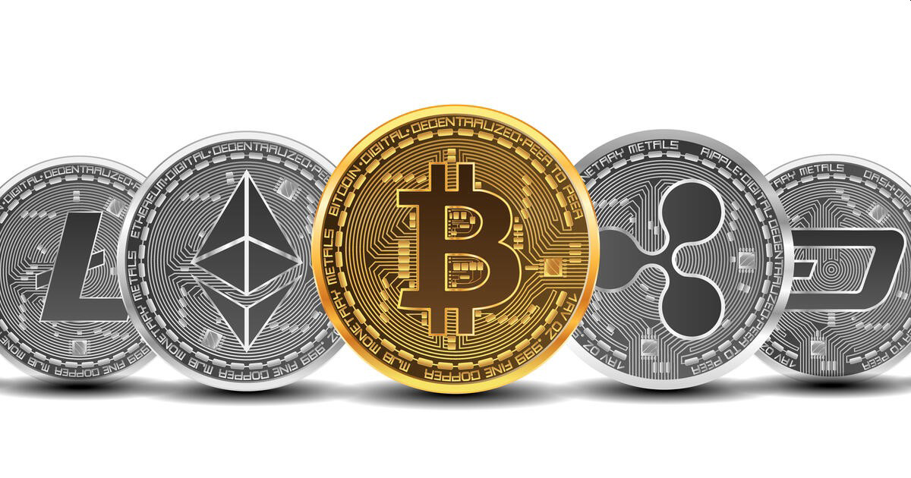

<h1 align='center'>
 <b>PROYECTO INDIVIDUAL Nº2</b>
</h1>

<h1 align="center">**`Cryptocurrency Market Data Analytics`**</h1>

<H1>Data Analyst: Javier Castro Hermoza </H1>  

<h2>Objetivo</h2>

* Analizar datos de la API CoinGecko para comprender el mercado de criptomonedas.
* Acotar tu análisis a al menos 10 criptomonedas.
* La elección de las criptomonedas está a tu criterio, pero debes justificar tu elección.

<h2>Contexto</h2>

* Crisis económica del 2008
* Aparición del Bitcoin en el 2009
* En el presente:
    * Miles de criptomonedas
    * Miles de sitios para analizar las criptomonedas
    * Herramientas como las Apis de CoinGecko que permite hacer un análisis más personalizado
    * Cientos de gurús expertos en criptomonedas y trading
    * Cientos de videos con tutoriales y definiciones  del tema
    * Cantidad abrumadora de información 
* Dificultad para encontrar fuentes que sean coherentes y confiables
* Inseguridad, por estafas y hackeos 
* Pronta aparición de las CBCC - Central Bank Cryptocurrency 

<h2>Conceptos</h2>

* **Criptomoneda,** dinero digital seguro y descentralizado
* **Categoría,** clasificación o agrupación en función de ciertas características o propósitos comunes. 
* **Mercado de capital,** termino financiero para definir el tamaño de un sector del mercado
* **Volumen en 24 horas,** cantidad que se ha comprado y vendido en todos los intercambios en las últimas 24 horas en el mercado al contado
* **Exchanges,** plataforma en línea donde los usuarios pueden comprar, vender o intercambiar criptomonedas. 
* **CBCC - Central Bank Cryptocurrency**, Moneda Digital de Banco Central, moneda digital emitida y respaldada por un banco central de un país.

<h2>API CoinGecko - Funciones utilizadas</h2>

**Informacion de la criptomomneda**

* cg.get_coins
* cg.get_coins_list
* cg.get_coins_markets
* cg.get_coin_by_id
* cg.get_coin_market_chart_range_by_id
* cg.get_coin_history_by_id
* cg.get_coin_ohlc_by_id

**Categorias**

* cg.get_coins_categories
* cg.get_coins_categories_list

<h2>CSV obtenidos como fuentes de datos</h2>

* categorias_lista, id y nombre
* categoria_name, solo nombre 
* categorias, información detallea de las categorias por criptomoneda
* categoria_top_3_coins, principales criprtomonedas por categoria 
* crypto_data, información detallada de cada criptomoneda
* crypto_tc, ultimo tipo de cambio por cada criptomoneda
* datos_historicos, precio, volumen y capitalización de mercado de los ultimos 05 años
* datos_historicos_ohlc, precio diario al apertura (open), elmás alto del día (Hight), el mas bajo del día (Low) y precio del cierre (Close), la información disponible es de los ultimos meses
* df_volumen, promedio, minimo y maximo de volumen 
* df_mercado, promedio, minimo y maximo de mercado 
* df_precio, promedio, minimo y maximo de precio 

<h2>Categorias de criptomoneda seleccionadas </h2>

* **Layer 1 (L1):** Se refiere a las criptomonedas que funcionan en la capa base de una cadena de bloques (blockchain) y no dependen de otra para operar.
* **Gaming (GameFi):** Criptomonedas utilizadas en la industria de los videojuegos y GameFi.

<h2>Motivos </h2>
Todas son subjetivas

* **Layer 1 (L1):** 
    * Es fácil de entender y proporciona una lista simple de criptomonedas muy populares.
    * Familiaridad, todos suelen haber oído hablar de las criptomonedas más grandes como Bitcoin y Ethereum, por lo que verán estas monedas en la parte superior de la lista.
    * Simplicidad, No requiere entender conceptos técnicos complejos. La capitalización de mercado es una medida "relativamente" fácil de entender.

* **Gaming (GameFi):** 
    * La industria del video juego y del gaming es constante y creciente
    * Es relativamente sencilla de entender 
    * El sector juegos utilizan monedas virtuales dentro de sus entornos
    * Actualmente los usuarios de este mercado utilizan dolares para comprar créditos dentro de un video juego

<h2>Criptomoneda escogidas par analizar </h2>

* Layer 1 (L1)
    * 'bitcoin'
    * 'ethereum'
    * 'tether'
    * 'binancecoin'
    * 'ripple'
    * 'usd-coin'
    * 'staked-ether'
    * 'cardano'
    * 'dogecoin'
    * 'solana’

* Gaming (GameFi)

    * 'internet-computer'
    * 'immutable-x'
    * 'the-sandbox'
    * 'axie-infinity'
    * 'apecoin'
    * 'gala'
    * 'illuvium'
    * 'enjincoin'
    * 'stepn'
    * 'floki'

<h2>KPI</h2>

* Tasa de tipo de cambio en USD
* Crecimiento de la capitalización de mercado
* Volumen Promedio de Negociación

<h2>KPI 1 – Tasa de tipo de cambio en USD </h2>

* Tipo de cambio por moneda, si esta fuera de su minimo y maximo de los ultimos 05 años

<h2>KPI 2 – Crecimiento de la capitalización de mercado </h2>

* Crecimiento actual comparado con el promedio de los ultimos 05 años

<h2>KPI 3 – Volumen Promedio de Negociación </h2>

* Variación del volumen de capiatl de las ultimas 24 horas comparado con el promedio delos ultimos 05 años

<h2>Conclusiones </h2>

* Bitcoin y Etherium son las criptomonedas más populares, con mayor precio, capitalización de mercado y volumen 
* Las criptomonedas y el trading, van de la mano a velocidad vertiginosa y de bastante riesgo

<h2>Recomedaciones </h2>

* Escoger cuidadosamente una categoría donde se sienta cómodo en invertir
* No seguir todas las predicciones, por ejemplo:
En Abril del 2024 ocurrirá el siguiente halving de Bitcoin
¿Es momento de invertir?
Todos recomiendan hacerlo un año antes
* Usar herramientas de Machine Learning e IA para estar siempre bien informados de los cambios bruscos de mercado y de las nuevas tendencias

<h2>Referencias</h2>

* https://www.youtube.com/watch?v=C-3aYnhF6Io
* https://www.youtube.com/watch?v=CXmXi9tLPfU
* https://www.youtube.com/watch?v=Om6DTEPXRek
* https://www.youtube.com/watch?v=uAybJ3IJ5GA
* https://libertex.org/es/blog/precio-de-criptomonedas#:~:text=Las%20criptomonedas%20son%20activos%20muy,en%20la%20regulaci%C3%B3n%20del%20valor
* https://criptoinforme.com/mercado/5-metricas-para-analisis-fundamental-de-criptomonedas-que-debes-conocer/
* https://www.youtube.com/watch?v=1-C5GsWmgGY
* https://www.youtube.com/watch?v=RI9t8Fo2DG4
* https://www.coinbase.com/es-LA/learn/crypto-basics/what-is-a-bitcoin-halving

